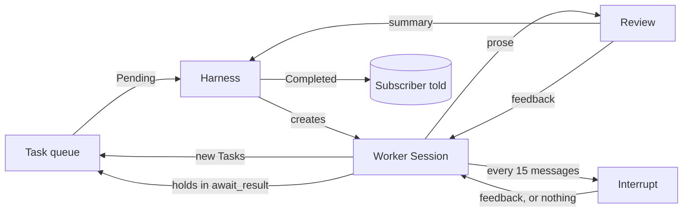
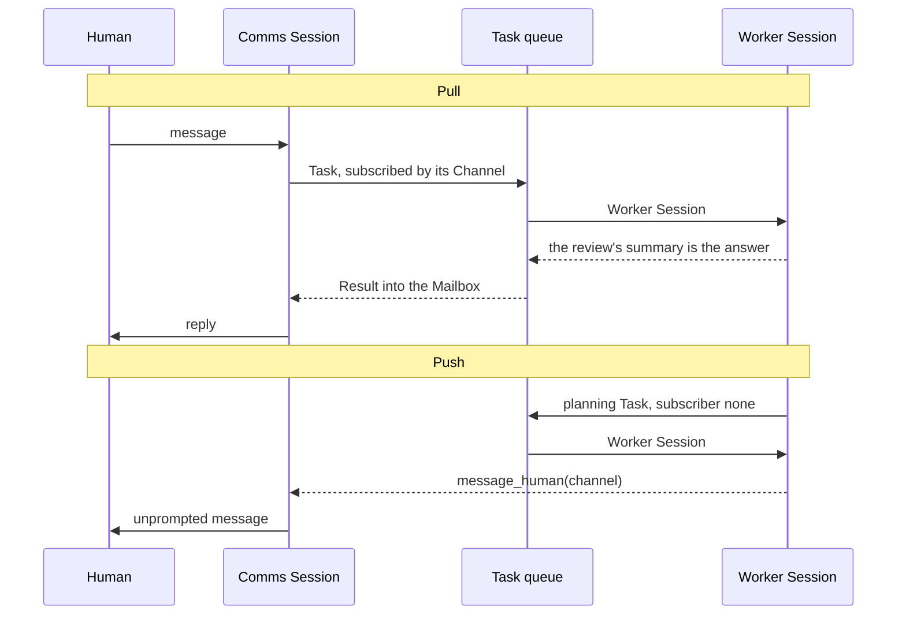

# Architecture

How the parts of Sandman fit together. For what the terms mean, read
[CONTEXT.md](./CONTEXT.md) first — this document does not repeat the definitions.

## Overview

Sandman has one queue, one database, one trace, and two shapes of live agent context.

The **Harness** owns all state, through the **Store**. Agents hold no state of their
own. They do not write files and they do not manage Tasks. They read a Brief, use
tools, and produce a Result. Everything else is the Harness's job.

A Worker that needs another Worker's answer does not park and get rebuilt. It holds
inside the `await_result` tool call, and the answer comes back as that call's result,
in the same Turn. The Session that asked remembers why it asked. A Comms Session
cannot do that — it is never re-run — so it subscribes instead, and the answer reaches
it as mail.

## Components

| Component | Agentic? | Owns |
| --- | --- | --- |
| Harness | No | The Store, and the loops that start work |
| Store | No | All state; the only thing that writes to the database or emits Events |
| Scheduler | No | The one in-flight model call, ordered by Tier |
| Waiters | No | Who is blocked in `await_result` on what |
| Role registry | No | System prompts and tool sets, closed set |
| Channel adapter | No | One connection to a human |
| Control socket | No | Tasks from a process that is not a human |
| Comms Session | Yes | The conversation on one Channel |
| Worker Session | Yes | One Task, until it completes |
| Web server | No | Watchers, and the browser Channel |

### Harness

The Harness is the application. It knows which Session holds which Task, and it moves
a Task from Pending to Running to Completed.

**Orchestration is plain code.** Nothing in the swarm decides what runs next. This may
later become agent-driven; keep that choice in one place.

### Store

All state, behind one domain-shaped vocabulary — `start_task`, `complete_task`,
`append_message` — rather than a set of fields. A caller says what happened and the
Store decides what that means in rows and in the trace.

Two properties hold structurally rather than by discipline:

**A change without an Event cannot be written.** The connection is private and no
method mutates without emitting. Nothing anywhere has to remember to announce
anything, because there is no way not to.

**A lock is never held across an await.** Every method takes `&self`, does its work,
and returns. Nothing hands a guard to a caller. The mutex is `std::sync::Mutex`
deliberately: a future awaited inside one of these methods would not compile, which is
exactly the warning wanted.

Reads return owned values. A model call already carries a detached copy of the
messages it was built from, so this is what the system did anyway.

### The database

SQLite is the single source of truth. There is no in-memory mirror, so there is
nothing for the two to disagree about. Every read is a query and every write is a
transaction — affordable because the swarm already serialises on one model call at a
time, and a query is microseconds against a network round trip.

Two rules shape the schema:

**A transcript is a query, not a blob.** Messages, mail, utterances and reflections
each get a row per item, keyed `(owner, idx)`. Appending is one insert. A JSON column
would mean rewriting a Session's whole history on every message, which makes a
long-running Comms Session quadratic.

**Sum types are a discriminant column plus JSON.** `tasks.state` holds
`pending | running | completed | cancelled` as its own column so the queue scan is an
index lookup; `tasks.state_json` holds what that variant carries. Nothing a query
filters on hides inside JSON.

Ids are minted from the `counters` table inside the transaction that uses them. They
survive a restart, and a fresh database counts from one — which is what lets two
Harnesses live in one process without sharing an id space.

Migrations are ordered statements under `meta.schema_version`. A database written by a
newer binary is refused, not partly read.

### The Event stream

Every change the Store makes emits an Event, and everything that needs to know what
happened reads that one stream: `log.rs` writes a line per Event, `web/` turns each
into a patch for a browser, and a bench case waits on it. State and sequence are one
mechanism.

The stream is broadcast, so consumers are independent. One that falls far enough
behind loses Events rather than slowing the swarm — the right trade for a trace, since
the database still holds the state.

Tool calls are not state changes, so the tool registry holds its own handle and emits
`ToolCalled` and `ToolReturned` itself. State and trace stay separately testable.

### Task queue

Every agent puts Tasks here, and every Worker Session comes from here. This is the
only route between agents. There is no direct agent-to-agent call.

Being picked has exactly one condition: time. A Task whose Schedule names a time waits
Pending until it comes. Holding for other work is not a condition here — it happens
inside a Turn, after a Task has already started.

A repeating Task is never finished for good: completing it creates the next
occurrence, anchored to the schedule rather than to when the last one ended, so a late
run does not push the next one back.

Cancelling is terminal. A pending Task never runs; a running one ends at its Session's
next decision point with no Result; a repeating one stops as a chain, or a running
occurrence would re-arm the next when it finished. Whoever was waiting is told, so
nobody hangs on it.

### Role registry

A Role is a system prompt and a set of tools. The set is closed and lives in code.
Tools are independent, so more than one Role can use the same tool.

`RoleName` is the single source of truth, and the functions that give a Role its
prompt and its tools match on it exhaustively — a Role added without either does not
compile.

Every prompt is a literal Markdown file compiled in with `include_str!`. A Worker's
system message is the shared mechanics joined to its Role's file, and nothing else:
nothing is templated, nothing is appended conditionally. The cost is repetition — the
Role catalogue is written out in each prompt that needs it — and it is paid on
purpose. A prompt that has to be assembled in the reader's head is a prompt whose
contradictions are invisible.

Which create-task tool a Role gets is part of this. There are three, and the split
keeps the common case — hand work to planning — free of the Role and schedule
arguments a Worker can get wrong, and gives a Role that should not choose Roles only
the narrow tool.

The `planning` Role carries `message_human`, the only Role that has it. It is how the
swarm reaches a human.

### Channel adapter

An adapter connects to one two-way transport. It converts inbound traffic into input
for a Comms Session and sends that Session's output back. The Comms Session does not
know which transport it sits on, and adding a transport must not change it.

Several Channels may be open at once, each with its own Comms Session, sharing
nothing — so as far as the swarm is concerned there are several humans, and
`message_human` has to name which one it is talking to.

The browser adapter has nothing to do on send: the text is already in the Channel's
transcript, the transcript is in the Store, and the same push that carries everything
else carries that too.

### Control socket

A Unix domain socket. One line of JSON in, one out, and the connection closes. Cron, a
mail watcher, an RSS script and a shell one-liner all arrive here.

It is a socket rather than a second writer to the database, and that is the decision
worth knowing. A process inserting a row directly would bypass the Store, so no Event
would be emitted for it — the log, a Watcher and anything replaying the stream would
all share the same blind spot. One writer is the property the Store is shaped around.

### Session

Both shapes run one Turn loop. A Turn is model calls and tool calls until the model
replies without calling a tool. It has no budget; the human watching is what stops it.

**A Turn decides nothing.** It reports how it ended — text, silence, an unreachable
model, or a Task cancelled underneath it — and the caller says what that means. This is
the seam worth protecting, because the two shapes differ by almost nothing else, and
they once ran as two copies of one loop until they quietly drifted apart.

The Session's state is in the Store, not in the loop. That is why the loop is a
function over a context rather than a method on an object: the state has to be
watchable while the loop awaits, and a loop that owns it cannot let anyone else look.

### Worker Session

Created from a Task, completes when that Task does. Uniform: every Worker runs the
same way, and only the Role of its Task differs. It sees the Brief and nothing of the
work that led to it.

**A Worker has no tool to submit anything.** When its Turn produces plain text, the
review reads the whole conversation. Its `<summary>` is the Task's answer; its
`<feedback>` goes into the Worker's context for another Turn instead; its `<lessons>`
is kept and nothing more. A review that writes neither falls back to the Worker's own
last words. A review of silence sends the Worker back to work. Only an unreachable
model fails a Task without a review.

### Comms Session

One per Channel. It is standing: it starts with the Channel and does not end. It keeps
the conversation across messages.

Its policy: the text a Turn produces is something to say to the human, and then it
goes idle. Text carrying `<no-response />` is silence too — models are bad at empty
replies, so the marker is how a Turn sends nothing. Silence is a legitimate ending:
unlike a Worker it owes nobody a Result, and it is never reviewed. It is interrupted
like any other Session, which is the only metacognition it ever sees.

It owns the human-facing voice. Content that reaches it may be passed on word for
word, or reworded and given context. That is its decision.

### The Scheduler

Every model call goes through one scheduler. Exactly one is in flight at any moment,
and the rest wait ordered by Tier, then by arrival within a tier:

1. Comms — a human is never left behind the swarm.
2. A Worker on a `high` Priority Task.
3. Metacognition — so a review is not held behind ordinary work.
4. A Worker on a `normal` Priority Task.
5. A Worker on a `low` Priority Task.

One call at a time is deliberate: it makes a run possible to follow, which is the only
guard against runaway work.

A higher-Tier call arriving while a lower one waits jumps ahead of it in the waiting
queue. It never aborts the call already in flight — that one is committed and paid. So
"skip the queue" means skip the *waiting* calls, not preempt the one with the model.
Within one tier, arrival order decides, which is what makes two same-tier Workers
alternate at the model-call level.

Each call is recorded in the Store the moment it joins the queue, not when it is sent,
so waiting is as visible as working.

The scheduler decides *when*; the `Model` seam decides *how*.

### Metacognition

Two of them, sharing everything but the question they ask.

A **review** runs when a Worker ends its Turn without calling a tool. It reads the
whole conversation and decides what that Turn meant for the Task.

An **interrupt** runs mid-Turn, on a message count, and decides nothing about the
Task. It exists for the failure a review structurally cannot see: a Worker that never
stops calling tools never produces a plain-text Turn, so it is never reviewed and can
grind on one dead end until something else stops it. It reaches Comms Sessions too,
which are never reviewed at all.

It fires from inside the Turn loop, not from a caller, and it has to: a caller only
sees Turns that finished, which is exactly what this exists to catch. The top of the
loop is where it goes, because there every tool call already has its result and a
pushed message cannot split the two.

The count runs from the last metacognition of either kind, so a Worker taking short
Turns is reviewed and never interrupted, and a Comms Session is interrupted on a plain
message count.

That an interrupt cannot complete a Task is a fact about its signature, not a check.

Both are recorded on the Session they judged, for inspection only: it never re-enters
the conversation, and the Session still cannot see it. Only Feedback reaches it, as a
message of its own.

**Both fail open, always.** A call that cannot be made is recorded as having found
nothing and the Session carries on. This matters most for the interrupt, which runs
mid-Turn on a Session that is otherwise fine: broken metacognition must never be what
wedges a run.

### The Lessons

Every review and every interrupt may end with a `<lessons>` section, and when it does
the Harness keeps it. A lesson is anchored on the Session that was judged — the way
back to the full conversation. What it is *about* varies: a Task for a Worker, a
conversation for a Comms Session.

Nothing reads a lesson back. It is written once, never edited, and found later only by
someone looking — which is the whole of what the `memory` Role does. Because state
persists, the Lessons now outlive the Run that wrote them and a search reaches every
Run.

Search is by meaning: text to a vector, ranked by cosine over the corpus. Two choices
are worth knowing.

**Indexing is lazy.** Nothing is embedded when a Task or a lesson is created — that
would put a network call on the path of `create_task`, which is synchronous and should
stay that way. The first search embeds what is not cached, in one batch, with the
query riding along. A cached vector is never stale, because nothing in the corpus is
edited after it is written.

**Brute force is the right shape.** An approximate index would be solving a problem
this system does not have. It stops being right somewhere in the tens of thousands of
entries.

An embedding call does not go through the scheduler. It has no Session, no
conversation and nothing to follow, so putting it in the one-call-at-a-time queue
would show it in the UI as work being done and hold it behind whatever the swarm is
saying. The price is that it is not a Model call and so never reaches Spend. See
[TASKS.md](./TASKS.md).

### Limits

There are none. A Turn has no budget, and nothing caps how many Tasks the swarm
creates. The guard rail is a human watching; a loop of Tasks creating Tasks will run
until it is interrupted. The interrupt makes a loop visible and can talk a Session out
of one, but it stops nothing by itself.

## Tools

| Tool | Available to | Effect |
| --- | --- | --- |
| `create_task(title, brief)` | `research`, `planning`, `memory`, Comms | Enqueues a planning Task. Returns its id. Does not wait. |
| `create_task_full(role, title, brief, run_at_seconds?, repeat_seconds?, priority?)` | `planning`, `task_manager` | Enqueues a Task with a chosen Role and timing. Returns its id. |
| `create_research_task(title, brief)` | `research` | Enqueues a research Task. Returns its id. |
| `await_result(task_id)` | every Worker Role | Holds this Turn until the Task completes, then returns its answer. A cancelled Task returns a notice instead. |
| `message_human(channel, content)` | `planning` | Injects into the Comms Session on that Channel. |
| `web_search(query, count?)` | `research` | Searches the web. Reads `unresponsive_engines`, so a rate limit is told apart from an empty web. |
| `web_fetch(url)` | `research` | Fetches a page and returns its readable text. Scripts never run. |
| `search_lessons(query, count?)` | `memory` | Ranks the Lessons by meaning. Each hit names its day, subject and Session. |
| `search_tasks(query, count?)` | `memory`, `task_manager` | Ranks Tasks by what they asked for — Title and Brief, never the Result. Shows the Result on a hit. |
| `view_session(id)` | `memory` | One Session's whole conversation, metacognition included, capped. Takes a Task id too. |
| `current_time()` | `memory` | The current weekday, date and time. |
| `list_tasks(state?, recurring?, count?)` | `task_manager` | Enumerates the queue, newest first. |
| `cancel_task(id)` | `task_manager` | Stops a Task by id. Tells whoever waited. |

This is the whole set. Metacognition holds nothing from it and nothing of its own: it
answers in `<summary>`, `<feedback>` and `<lessons>` sections, and the Harness reads
them.

A tool answers the model in words, always — including when it failed. An error a model
can read is domain output, not a Rust error, and the same reasoning applies as to a
Result: a failure is something that says so, not something missing.

Schemas are built for each Session rather than declared once, because `message_human`
must offer the Channels that are actually open.

## Seams

Four traits, each with a real adapter and a bench adapter. Two adapters is what makes
a seam real rather than hypothetical.

| Trait | Real | Bench |
| --- | --- | --- |
| `Model` | OpenRouter over the wire | replies written by the test |
| `ToolRunner` | the tool registry | the registry, watched and answered for |
| `Clock` | the system clock | stopped, or moved by hand |
| `Embedder` | the embedding service | whatever a test wants |

`Model` sits **under** the scheduler on purpose, so a bench that scripts the model
still exercises the real queue, the real Tier ordering and the real
one-call-at-a-time invariant.

`ToolRunner` is the interesting one. Wrapping the real registry in a recorder is how a
unit bench watches every call a model makes without changing a single prompt, and
answering from a closure is how it drives a model down a path without paying for the
work behind it.

`web_search` and `web_fetch` need no HTTP seam of their own: they are tools, so they
are already interceptable here.

These are the other boundaries worth protecting.

**The queue is the only path between agents.** Nothing calls anything directly. Every
new capability arrives as a Task with a Role.

**The Brief is the boundary between parent and child.** A Worker starts fresh.
Whatever the parent failed to write down is lost. This keeps Tasks portable, and it is
the most likely source of trouble.

**Agents never own state.** If an agent appears to need somewhere to keep something,
the Harness should keep it instead.

**Every Task becomes a Worker Session.** A Task never targets a Comms Session. This
keeps the dispatch rule single and branchless — including for an answer a Comms Session
subscribed to, which lands in its Mailbox rather than as a special kind of delivery.

**Only the review submits.** A Worker cannot end its own Task, so what reaches a
subscriber is chosen from the whole conversation, not taken from whatever the Worker
last said.

**A Turn decides nothing.** Put ending policy in `worker.rs` or `comms.rs`, never in
`session.rs` — and put metacognition itself in `reflect.rs`. The moment the loop knows
about Results or Channels, the two shapes start growing apart inside it again.

**The Channel adapter hides the transport.** Adding a transport must not change a
Comms Session.

**Nothing but the Store touches the database.** One writer, one place that knows what
a column is called.

**Metacognition is harness machinery, not an agent.** Modelling either kind as a swarm
member would make its outcome asynchronous and hold answers hostage on a pending
review.

**A Watcher only reads.** A swarm must behave the same whether anything is watching it
or not.

## Data flow

### Input

Three things start work:

1. A human sends a message on a Channel. The adapter passes it to the Comms Session,
   which decides whether to answer directly or to issue a Task.
2. A process sends a request to the control socket. This creates a Task directly.
3. A one-shot command line run creates a Task and runs until nothing is left.

### The main loop



The Harness does not round-robin live Sessions. Each runs its own Turn loop
concurrently, and every model call those loops make waits on the scheduler. The
Harness's loop only starts work that is not yet in motion — a Pending Task whose time
has come, or a Comms Session with mail — and the Sessions keep turning between starts.
So when one Session creates two Tasks, both children run at once, and the one needing
fewer Turns finishes first whatever order they started in.

### Reaching the human

One route, and the two directions differ only in who started the exchange.

**Pull** — the human asked. The Comms Session issues a Task subscribed to its Channel;
the answer lands in its Mailbox and it tells the human.

**Push** — nobody asked. A Worker mid-run creates a `planning` Task, subscribed to by
nobody. The planning Worker calls `message_human`, which injects into the Comms
Session on the Channel it names.



Push is where the guessing lives. With more than one Channel open, that Worker is
choosing *which human to tell*, and it has nothing solid to choose with: a Task
carries no record of where it came from, because a Brief stands alone. See
[TASKS.md](./TASKS.md).

## Watching a run

Two ways, and they show different things. The browser shows what is true **now**; the
log shows what happened **in order**. Neither replaces the other, and both read the
same Event stream.

### The browser

A Watcher gets one snapshot carrying everything, then a patch per Event. Patches carry
whole entities rather than field diffs, so a Watcher merges one without knowing its
shape, and every connection begins with a fresh snapshot, so reconnecting needs no
replay.

The UI is a projection and nothing more. It recomputes nothing.

### The log

`sandman.log` carries the sequence, which a view of state cannot show: two Tasks that
both ran are indistinguishable in a snapshot.

**The log is the index; the database is the content.** A line names what happened and
the id to look it up under. It does not carry a model's whole reply, a Brief, or a
recorded request — those are rows, and a log that reprinted them would bury the
sequence it exists to show. `--verbose` restores the bodies.

The terminal shows only the conversation, so the two never interleave.

### What the states mean

A Task is `pending`, `running`, then `completed` — including when its Result records a
failure — or `cancelled`, with no Result at all.

A Session is `waiting` between Turns; `thinking` while a model call is out; `tools`
while it runs tool calls; `idle` between Turns (Comms only); `reflecting` while
metacognition runs on it; and `finished` or `failed` once done. Finished Sessions stay
in the database for inspection.

A model call is `queued` before it is sent, `in_flight` while waiting, then `done` or
`failed`. The record is created when the call joins the queue, so waiting is as
visible as working. Because calls are sequential, at most one is ever `in_flight`.

A `done` call records its tokens and what it cost — what the provider billed, taken
from the response rather than worked out from a price list, so it stays right when
pricing changes. Spend is summed from those calls each time it is shown, never
accumulated, so it cannot drift from them. Cost is held as an integer of nano-dollars,
so a sum of several hundred fractions of a cent is exact.

## Invariants

- One Task concept. A human request, an investigation, and delegated work are the same
  thing.
- A Task has exactly one Result, on success or on failure — or it is cancelled, in
  which case there is none.
- Only the review completes a Task; only an unreachable model fails one without a
  review, and only a cancellation stops one mid-run.
- One Comms Session per Channel.
- A Role is a property of a Task, never a kind of agent.
- Exactly one model call is in flight, across the whole Harness.
- Every state change emits exactly one Event.
- Nothing but the Store writes to the database.
- No mechanical bound on any loop; the human watching is the guard rail.

## File index

```
src/
  domain/           Every definition. No logic.
    ids.rs          One newtype per entity, minted by the Store.
    text.rs         Title, Brief, Day — checked once, at the edge.
    time.rs         Timestamp, Duration, Cost, and the Clock seam.
    run.rs          One lifetime of Sandman.
    task.rs         The single unit of work.
    session.rs      A live agent context, and metacognition's record of it.
    call.rs         One exchange with the model.
    channel.rs      A two-way connection to a human.
    lesson.rs       What metacognition kept.
    message.rs      The conversation, and what a model call gives back.
  event.rs          The one ordered trace.
  db/               SQLite: schema, migrations, rows to domain values.
  store.rs          All state, behind one vocabulary. Emits every Event.
  waiters.rs        Who is blocked in await_result on what.
  scheduler.rs      One call in flight, ordered by Tier then arrival.
  model.rs          The Model seam, the OpenRouter adapter, the wire shape.
  memory.rs         The Embedder seam, and ranking by meaning.
  roles.rs          The closed Role set: prompt plus tool names.
  prompts.rs        Every prompt, compiled in.
  prompts/          One plain Markdown file per prompt.
  tools/            The Tool and ToolRunner seams, and every tool.
  reflect.rs        Metacognition: the review, and the interrupt.
  session.rs        The Turn. Both shapes run this, and it decides nothing.
  worker.rs         Worker policy: prose triggers a review.
  comms.rs          Comms policy: prose is something to say.
  harness.rs        Task lifecycle, delivery, and the loops that start work.
  control.rs        The control socket.
  log.rs            The Event stream, as sandman.log.
  channels/         One connection to a human each.
  web/              The Watcher UI: sockets, and Events as frames.
  bench/            A Sandman under test, with four seams to make unreal.
  bin/              sandman, and the bench driver.
tests/
  cases.rs          The bench cases, as ordinary tests.
```
